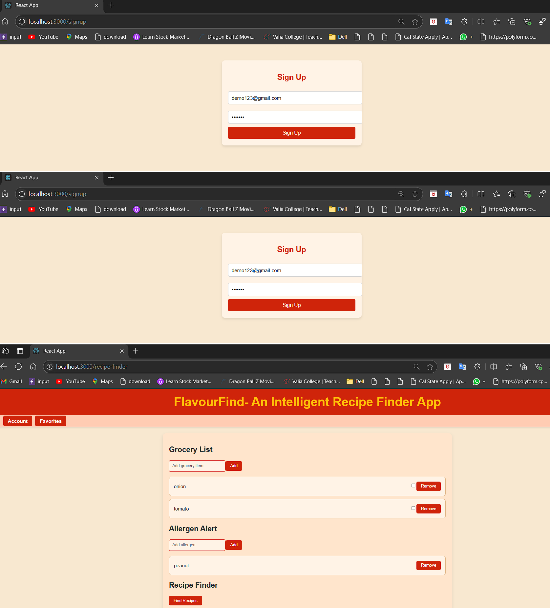

# Recipe Finder and Grocery List Application

A full-stack web application that helps users find allergen-aware recipes based on available ingredients and generate grocery lists automatically.

Built using **React**, **Django**, **Firebase**, and integrated with the **Spoonacular API**.

---

## 🌟 Features

- 🔎 Ingredient-based intelligent recipe search
- 📋 Automated grocery list generation
- 🍽️ Allergen-aware recipe suggestions
- 🔒 Secure user authentication (Firebase)
- 📄 User-specific dashboards
- ⚡ Responsive and mobile-friendly UI

---

## 🛠️ Tech Stack

- **Frontend:** React, Bootstrap
- **Backend:** Django, Django REST Framework
- **Authentication:** Firebase Authentication
- **Database:** Firebase Realtime Database / Firestore (if used)
- **APIs:** Spoonacular API
- **Other:** Selenium (for testing), CI/CD pipelines

---

## 🚀 How to Run Locally

### Frontend (React)

1. Navigate to the frontend directory:
   ```bash
   cd frontend
Install dependencies:

bash
Copy
Edit
npm install
Start the frontend server:

bash
Copy
Edit
npm start
Backend (Django)
Navigate to the backend directory:

bash
Copy
Edit
cd backend
Install dependencies:

bash
Copy
Edit
pip install -r requirements.txt
Apply migrations:

bash
Copy
Edit
python manage.py migrate
Start the Django server:

bash
Copy
Edit
python manage.py runserver
🖼️ Screenshots


📜 License
This project is licensed under the MIT License.

🤝 Connect with Me: https://www.linkedin.com/in/nishank-mhatre/
LinkedIn: Nishank Mhatre

GitHub: Nishank1403
